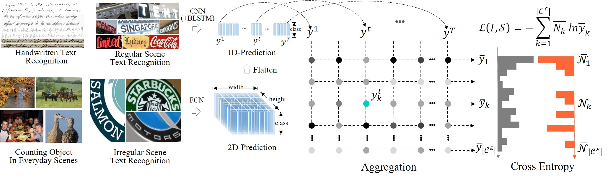
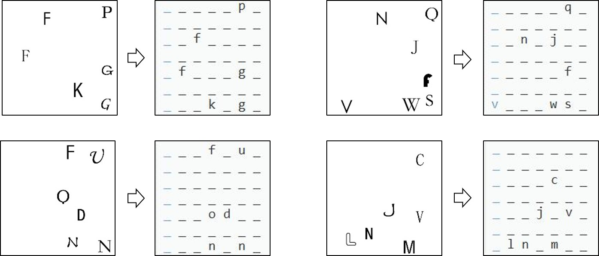

# Aggregation Cross-Entropy for Sequence Recognition
This repository contains the code for the paper **Aggregation Cross-Entropy for Sequence Recognition**. Zecheng Xie, Yaoxiong Huang, Yuanzhi Zhu, Lianwen Jin, Yuliang Liu and Lele Xie. CVPR. 2019. [\[Paper\]](https://arxiv.org/abs/1904.08364)

Connectionist temporal classification (CTC) and attention mechanism are the most popular methods for sequence-learning problem. However, CTC relies on a sophisticated forward-backward algorithm for transcription, which prevents it from addressing two-dimensional (2D) prediction problem, whereas the attention mechanism leans on a complex attention module to fulfill its functionality, resulting in additional network parameters and runtime. 

In this paper, we propose a novel method, aggregation cross-entropy (ACE), for sequence recognition from a brand new perspective. The ACE loss function exhibits competitive performance to CTC and the attention mechanism, with much quicker implementation (as it involves only four fundamental formulas), faster inference\back-propagation (approximately *O(1)* in parallel), less storage requirement (no parameter and negligible runtime memory), and convenient employment (by replacing CTC with ACE). Furthermore, the proposed ACE loss function exhibits two noteworthy properties: (1) it can be directly applied for 2D prediction by flattening the 2D prediction into 1D prediction as the input and (2) it requires only characters and their numbers in the sequence annotation for supervision, which allows it to advance beyond sequence recognition, e.g., counting problem.


Figure 1: Illustration of proposed ACE loss function. Generally, the 1D and 2D predictions are generated by integrated CNN-LSTM and FCN model, respectively. For the ACE loss function, the 2D prediction is further flattened to 1D prediction. During aggregation, the 1D predictions at all time-steps are accumulated for each class independently. After normalization, the prediction, together with the ground-truth, is utilized for loss estimation based on cross-entropy.


Figure 2: Toy example to show the advantage of ACE loss function. Resnet-50 trained with ACE loss function is able to recognize shuffled characters in the images. For each sub-image, the right column shows the 2D prediction of the recognition model for the text images. It is noteworthy that they have similar character distributions in the 2D space.

## Requirements
- [Python 2.7](https://www.python.org/) 
- [PyTorch >= 0.4.1](https://pytorch.org/) 
- [TorchVision](https://pypi.org/project/torchvision/)
- [OpenCV](https://opencv.org/)

## Data Preparation
tar -xzvf data.tar.gz

## Training and Testing
Start training: (in 'source/' folder)
```bash
  sh train.sh
```
- The training process should take **about 10s** for 100 iterations on a 1080Ti.

## Citation
```
@inproceedings{xie2019ace,
  title     = {Aggregation Cross-Entropy for Sequence Recognition},
  author    = {Zecheng Xie, Yaoxiong Huang, Yuanzhi Zhu, Lianwen Jin, Yuliang Liu and Lele Xie},
  booktitle = {CVPR}, 
  year      = {2019},
}
```

## Attention
The project is only free for academic research purposes.